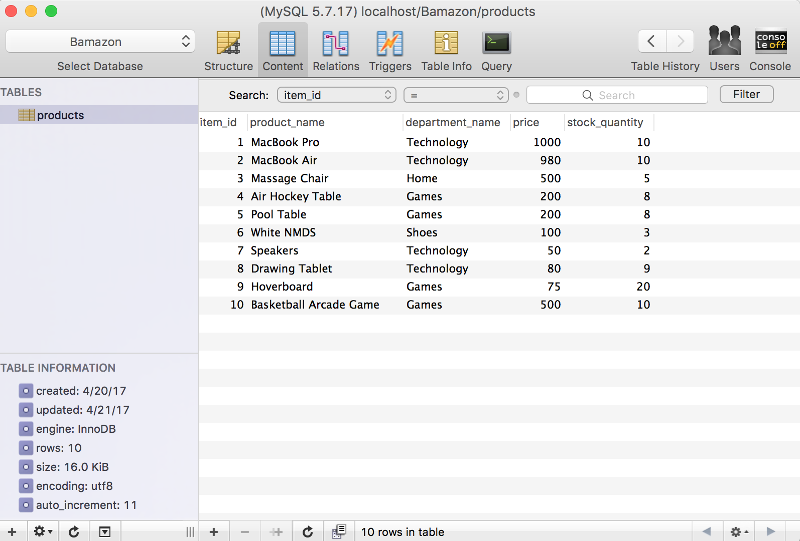
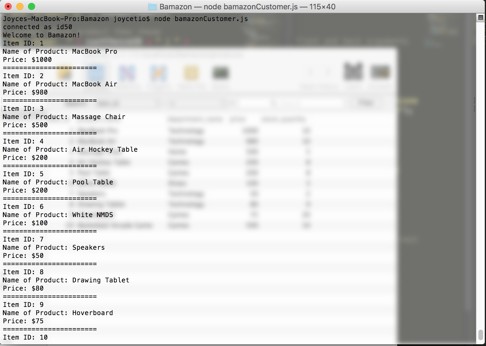
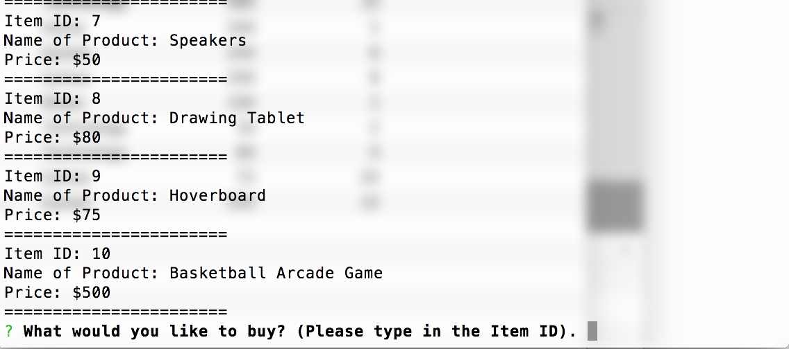
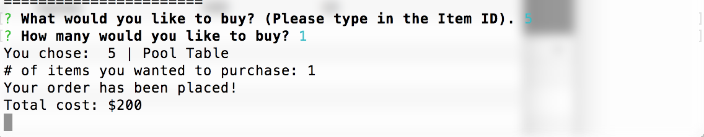
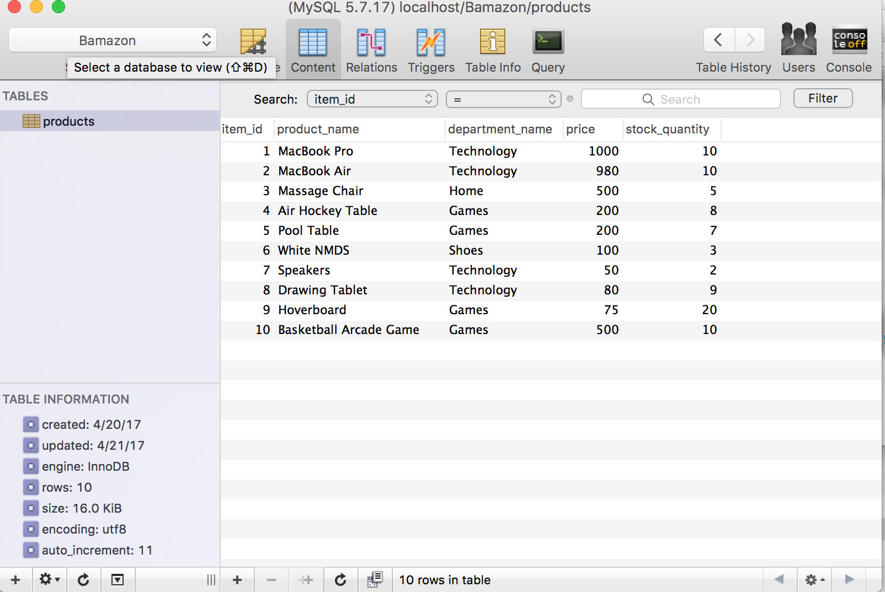

# Bamazon-HW

## Overview 
In this activity, you'll be creating an Amazon-like storefront with the MySQL skills you learned this week. The app will take in orders from customers and deplete stock from the store's inventory. As a bonus task, you can program your app to track product sales across your store's departments and then provide a summary of the highest-grossing departments in the store. 
Make sure you save and require the MySQL and Prompt npm packages in your homework files--your app will need them for data input and storage. 

## Instructions 
**CHALLENGE #1: Customer View** 
1. Create a MySQL Database called Bamazon. 
2. Then create a table inside of that database called products. 
3. The products table should have each of the following columns: 
    * item_id (unique id for each product)
    * product_name (Name of product)
    * department_name 
    * price (cost to customer)
    * stock_quantity (how much of the product is available in stores)
4. Populate this database with around 10 different products (i.e. insert "mock" data rows into this database and table). 
5. Then create a Node application called bamazonCustomer.js. Running this application will first display all of the items available for sale. Include the ids, names, and prices of products for sale. 
6. The app should then prompt users with two messages: 
    * The first should ask them the ID of the product they would like to buy. 
    * The second message should ask how many units of the product they would like to buy. 
7. Once the customer has placed the order, your application should check if your store has enough of the product to meet the customer's request. 
    * if not, the app should log a phase like Insufficient quantity!, and then prevent the order from going through. 
8. However, if your store does have enough of the product, you should fulfill the cutomer's order. 
    * This means updating the SQL database to reflect the remaining quantity. 
    * Once the update goes through, show the customer the total cost of their purchase. 

## Technologies Used: 
* npm packages 
* mySQL / Sequel Pro 
* Node.js 

## Submission Screenshots: 
* Sequel Pro Database: before customer buys any products. 


* Bamazon: 
* At first, it will show a list of products available in the store. 
* It then asks the user what they would like to buy, and how many they would like. 







* The database is then updated after the customer orders, in this case, a Pool Table. 



## Code Explanation: 
* Creates a connection between MySQL Database and Node. 
````
var mysql = require("mysql");

var connection = mysql.createConnection({
    host: " ",
    port: " ",
    user: " ",
    password: "",
    database: "Bamazon"
});
````


